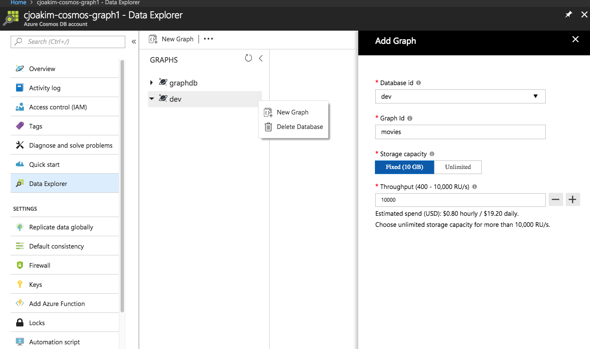
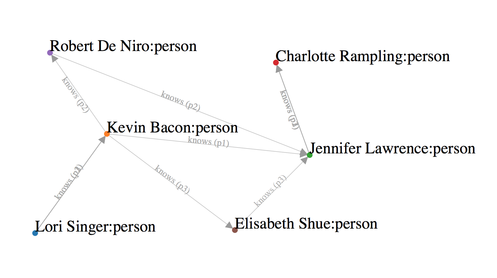

# azure-cosmos-graph

CosmosDB Graph Database example - the N-Degrees of Kevin Bacon (or Julia Roberts or Richard Gere or Diane Lane or Lori Singer ...)

Start with the IMDb datasets, wrangle them to a smaller size, load them into
the CosmosDB/GraphDB, and search for the nth degrees of Kevin Bacon and others.

## The Six Degrees of Kevin Bacon

This CosmosDB/GraphDB example was inspired by [this](https://en.wikipedia.org/wiki/Six_Degrees_of_Kevin_Bacon)

> "...in a January 1994 interview with Premiere magazine discussing the film The River Wild, mentioned that "he had worked
> with everybody in Hollywood or someone who’s worked with them."[1] On April 7, 1994, a lengthy newsgroup thread headed
> "Kevin Bacon is the Center of the Universe" appeared.  Four Albright College students: Craig Fass, Christian Gardner,
> Brian Turtle, and Mike Ginelli created the game early in 1994."

It rests on the assumption that anyone involved in the Hollywood film industry can be linked through their film roles to Bacon within six steps.


## CosmosDB Provisioning

In Azure Portal, provision a CosmosDB with the Graph API.

Capture its keys in the Azure Portal, and set these as environment variables to similar values:
```
AZURE_COSMOSDB_GRAPH1_ACCT=cjoakim-cosmos-graph1
AZURE_COSMOSDB_GRAPH1_CONN_STRING=AccountEndpoint=https://cjoakim-cosmos-graph1.documents.azure.com:443/;AccountKey=h2D...Sw==;
AZURE_COSMOSDB_GRAPH1_DBNAME=dev
AZURE_COSMOSDB_GRAPH1_KEY=h2D...Sw==
AZURE_COSMOSDB_GRAPH1_URI=https://cjoakim-cosmos-graph1.documents.azure.com:443/
```

Within the DB account, create database id **dev** with graph id **movies** as shown.
It is recommended that you specify 10,000 RUs.




## This Project

This project contains **both** the data-wrangling logic as well as the end-result data
that you can simply use.

At this time (3/12/2018) these instructions and scripts are oriented toward "standard" Python 3.6.4
from Python.org running on macOS.  However, I plan on enhancing them for Anaconda Python on an
Azure Ubuntu Data Science Virtual Machine (DSVM) later this week.

To create the Python virtual environment, run the following from Terminal:
```
$ git clone git@github.com:cjoakim/azure-cosmos-graph.git
$ cd azure-cosmos-graph
$ ./venv.sh
$ source bin/activate
$ python --version
Python 3.6.4
```

To use the pre-wrangled data skip the following **Data Wrangling** section and down to the
**Load the Database** section on this page.

As of 2018/03/12 these instructions and scripts work on macOS.

TODO - enhance these instructions and scripts to work on an Azure Ubuntu DSVM with Anaconda Python.

### Data Wrangling

The source data for this project is the **Internet Movie Database (IMDb)**.  It contains millions of rows
of data related to Hollywood moves, their actors/participants, and their ratings.

This data can be downloaded from here:
- http://www.imdb.com/interfaces/
- https://datasets.imdbws.com

The wrangling logic in this project filters this huge amount of data into a small subset that
is easily loaded into CosmosDB for your exploration.  The wrangling logic is implemented in Python 3.

In short, the wrangling steps are:
- Start with a manually created list of just 6 favorite actors (see 'actors_for_candidate_movies' below)
- Extract just the movies for those actors (approx 269 movies)
- Filter the movies by minimum rating
- Extract the principals (i.e. - actors) for those filtered movies.  Omit directors, producers, stunt men, etc.
- Extract the details for each of the principals
- Derive the person-knows-person Edges based on the set of actors for each movie.
- Generate a list of Gremlin commands to insert the Vertices (movies, actors) and Edges into the DB
- Note, the Gremlin command generation was intentionally decoupled from the actual DB loading.

See bash shell scripts **wrangle.sh** and **create_load_queries.sh** which implement this process.

You'll need to set the following environment variable in order to execute the wrangling process
from the downloaded and unzipped files:
```
IMDB_DATA_DIR=<some directory on your computer>
```

Within $IMDB_DATA_DIR there should be raw/ and processed/ subdirectories.  The downloaded
and unzipped IMDb data should be in the raw/ directory.

This is the list of the 6 actors as Python code:
```
    def actors_for_candidate_movies(self):
        # This set of actors drives the selection of movies in the IMDb data-wrangling process.
        actors = dict()
        actors['nm0000102'] = 'kevin_bacon'
        actors['nm0000126'] = 'kevin_costner'
        actors['nm0000152'] = 'richard_gere'
        actors['nm0000158'] = 'tom_hanks'
        actors['nm0000210'] = 'julia_roberts'
        actors['nm2225369'] = 'jennifer_lawrence'
        return actors
```

### Load the Database

File **data/processed/load_queries.txt** contains the pre-wrangled data that
you can simply load into your DB.  It contains 4648 Gremlin commands to insert the
set of Vertices and Edges connecting them.

To load this data into your dev/movies DB, execute the following bash script:
```
$ ./execute_load_queries.sh
```

This process will take approximately an 40-minutes, as there is a built in sleep time between
inserts.  853 Vertices should be inserted (269 movies, 584 people), with 3665 Edges.

For best results, don't query the DB from another process, such as the Azure Portal UI,
while the load process is executing.

### Query the Database

The following are example Gremlin queries.  These can either be executed within the Azure Portal
or with the Python client.

```
count the vertices:
query: g.V().count()

diane_lane_edges:
query: g.V('nm0000178').bothE()

diane_lane_in:
query: g.V('nm0000178').out('in')

diane_lane_knows:
query: g.V('nm0000178').out('knows')

julia_roberts_edges:
query: g.V('nm0000210').bothE()

julia_roberts_in:
query: g.V('nm0000210').out('in')

julia_roberts_knows:
query: g.V('nm0000210').out('knows')

kevin_bacon_edges:
query: g.V('nm0000102').bothE()

kevin_bacon_in:
query: g.V('nm0000102').out('in')

kevin_bacon_knows:
query: g.V('nm0000102').out('knows')

lori_singer_edges:
query: g.V('nm0001742').bothE()

lori_singer_in:
query: g.V('nm0001742').out('in')

lori_singer_knows:
query: g.V('nm0001742').out('knows')

movie_footloose:
query: g.V().has('label','movie').has('id','tt0087277')

movie_pretty_woman:
query: g.V().has('label','movie').has('id','tt0100405')

person_julia_roberts:
query: g.V().has('label','person').has('id','nm0000210')

person_kevin_bacon:
query: g.V().has('label','person').has('id','nm0000102')

person_nm0001742:
query: g.V().has('label','person').has('id','nm0001742')

person_richard_gere:
query: g.V().has('label','person').has('id','nm0000152')

richard_gere_edges:
query: g.V('nm0000152').bothE()

richard_gere_in:
query: g.V('nm0000152').out('in')

richard_gere_knows:
query: g.V('nm0000152').out('knows')

-- Path Queries

path_richard_gere_to_julia_roberts:
query: g.V('nm0000152').repeat(out().simplePath()).until(hasId('nm0000210')).path().limit(3)

path_richard_gere_to_kevin_bacon:
query: g.V('nm0000152').repeat(out().simplePath()).until(hasId('nm0000102')).path().limit(3)

path_richard_gere_to_lori_singer:
query: g.V('nm0000152').repeat(out().simplePath()).until(hasId('nm0001742')).path().limit(3)

path_diane_lane_to_lori_singer:
query: g.V('nm0000178').repeat(out().simplePath()).until(hasId('nm0001742')).path().limit(3)

```

WIP Queries:
```
g.V(['nm0000178','nm0000102','nm0001742'])
```

See file queries.sh.  These previously executed queries have been captured to files in the
queries/ directory in this project.

## Visualizations with D3.js

You can start a local python web server by running the command below:
```
$ ./webserver.sh
```

The visit **http://localhost:8000/d3/index.html** with your web browser.  You should be able
to see a D3.js visualization of your latest path query.  For example, the "knows" path from
Lori Singer to Charlotte Rampling is shown below.



## Gremlin-Python and Apache TinkerPop

Apache TinkerPop is a graph computing framework for both graph databases (OLTP)
and graph analytic systems (OLAP).  CosmosDB uses the Gremlin API, and the Python code
in this project accesses Gremlin via the **gremlinpython** library, version 3.2.7.

Here are some useful links to Apache TinkerPop and Gremlin:
- http://tinkerpop.apache.org
- http://tinkerpop.apache.org/docs/3.2.7/recipes/
- http://tinkerpop.apache.org/docs/current/reference/#gremlin-python
- https://pypi.python.org/pypi/gremlinpython/3.2.7
- https://docs.microsoft.com/en-us/azure/cosmos-db/create-graph-gremlin-console
